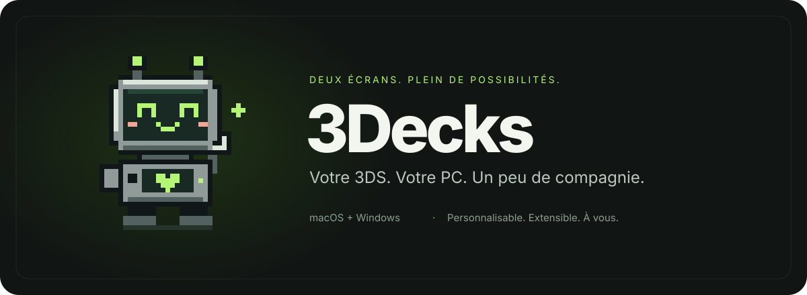

<div align="center">



# 3Decks

**Votre Nintendo 3DS devient votre télécommande de bureau.**

[Installation](docs/INSTALLATION.fr.md) · [Documentation](docs/README.fr.md) · [English](README.md)

</div>

3Decks transforme une 3DS ou 2DS avec homebrew en surface de contrôle pour l’ordinateur. L’application de bureau est désormais construite avec **Tauri 2, Rust et un éditeur partagé React/HeroUI**. Elle découvre les consoles sur le réseau local, les appaire et leur transmet commandes et tableaux de bord.

| Dossier | Rôle |
|---|---|
| [`apps/desktop/`](apps/desktop/README.md) | Application ordinateur : backend Tauri/Rust et éditeur React dans [`frontend/`](apps/desktop/frontend/README.md) |
| [`apps/console/`](apps/console/README.fr.md) | Application C pour 3DS/2DS et ses ressources de packaging |
| [`docs/`](docs/README.fr.md) | Guides actuels |

À la racine, `tools/` et `.github/` regroupent les contrôles et l’automatisation communs aux deux applications.

Le parcours macOS a été essayé avec Citra et Apple Music. Les adaptateurs Windows doivent encore être qualifiés sur une vraie machine ; Linux viendra ensuite. Aucune version de bureau publique n’a encore été publiée.

Pour développer, installez Rust, Node.js 24, pnpm 11 et les [prérequis Tauri 2](https://v2.tauri.app/start/prerequisites/), puis lancez :

```sh
cd apps/desktop/frontend && pnpm install --frozen-lockfile
cd .. && npm ci && npm run tauri -- dev
```

La [publication](docs/RELEASE.fr.md) prépare une Release GitHub **en brouillon** après un tag de version. La signature de distribution et les essais Windows restent nécessaires avant publication. Utilisez un réseau local de confiance ; n’exposez pas les ports de la console sur Internet.

[GPL-3.0-only](LICENSE). Police Inter sous [SIL Open Font License](docs/licences/Inter-OFL.txt). Projet indépendant, non affilié à Nintendo.
