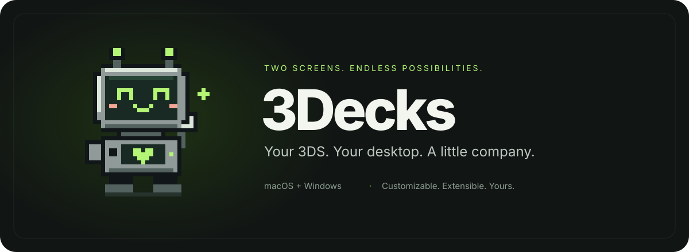
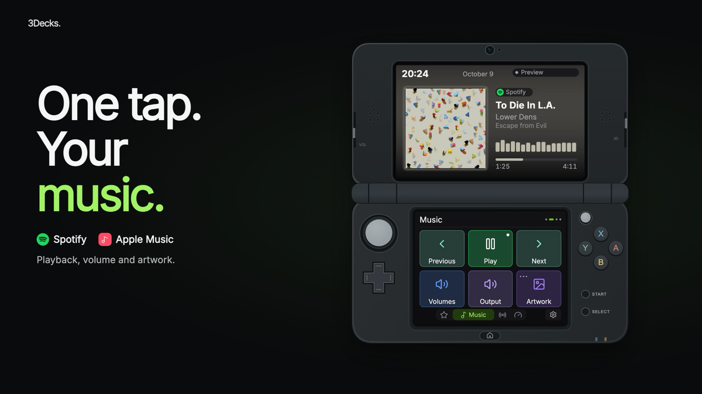

<div align="center">



# 3Decks

**Your Nintendo 3DS. Your desktop controls.**

[Get started](docs/INSTALLATION.md) · [Documentation](docs/README.md) · [Français](README.fr.md) · [Discord](https://discord.gg/EmdnneHeus)

</div>

3Decks turns a homebrew-enabled Nintendo 3DS or 2DS into a wireless control
surface for your computer. Create pages in the desktop editor, then use the
console's touch screen to control apps, music, audio and OBS.

[](docs/assets/meet-decky.mp4)

**[▶ Watch the video — Meet Decky](docs/assets/meet-decky.mp4)**

## Features

- Visual page editor with six-button grids, scrollable lists and a live preview.
- Music controls, album artwork and optional synchronized lyrics.
- Application shortcuts, keyboard shortcuts and open-window lists.
- Audio controls, computer statistics and OBS WebSocket integration.
- Native extensions with custom actions, button content and top-screen dashboards.
- Individual console pairing, saved layouts and English/French interfaces.

The desktop app uses Tauri 2, Rust and React/HeroUI. The console client is written
in C. macOS and Windows have native integrations; feature availability depends
on the OS and player. Linux system integrations are incomplete. See the
[platform matrix](apps/desktop/PLATFORM_STATUS.md) for limitations.

## Get started

You need a homebrew-enabled console, a computer and a shared local network.
Follow [installation and pairing](docs/INSTALLATION.md), then
[create your first page](docs/USAGE.md). Available packages are listed under
[GitHub Releases](https://github.com/RomualdYT/3Decks/releases).

For help, bugs, updates and community homebrew projects, join
[Discord](https://discord.gg/EmdnneHeus). Both apps also provide a community QR code.

## Build from source

Install Rust stable, Node.js 24, pnpm 11 and the platform dependencies described
in the [contributor guide](docs/CONTRIBUTING.md). From the repository root:

```sh
cd apps/desktop/frontend
pnpm install --frozen-lockfile
cd ..
npm ci
npm run tauri -- dev
```

For the console, run `./build.sh all` with Docker running. Outputs are
`apps/console/deck3ds.3dsx` and `apps/console/deck3ds.cia`.
See [console packaging](docs/CONSOLE_PACKAGING.md).

## Repository

| Directory | Contents |
| --- | --- |
| [apps/desktop](apps/desktop/README.md) | Desktop application and shared React editor |
| [apps/console](apps/console/README.md) | Native Nintendo 3DS/2DS application |
| [examples/extensions/focus](examples/extensions/focus/README.md) | Complete Pomodoro extension and package builder |
| [docs](docs/README.md) | User guides and developer references |
| [resources](resources/README.md) | Shared asset sources and regeneration instructions |

Use a trusted local network: console traffic is not encrypted. Extensions run
with your account's permissions after approval. See [security](docs/SECURITY.md).

[GPL-3.0-or-later](LICENSE). Inter uses the
[SIL Open Font License](docs/licences/Inter-OFL.txt); Lucide's licence is included
with the [console icons](apps/console/packaging/icons/LUCIDE-LICENSE).
3Decks is an independent homebrew project, not affiliated with Nintendo.
