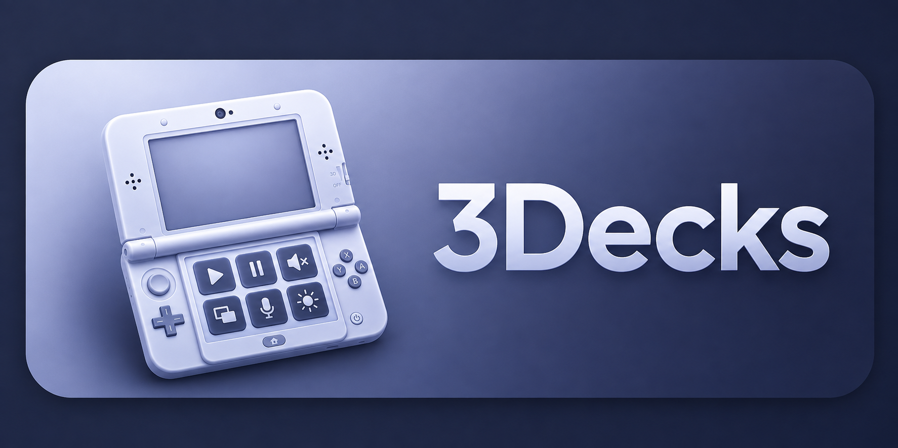

<div align="center">



<h1>3Decks</h1>

<p><strong>Turn your Nintendo 3DS into a Stream Deck for your computer.</strong></p>

<p>
Create your own buttons, launch apps, switch between open windows, control
Spotify, manage volume, change audio devices, receive desktop notifications, and
see what is currently playing — album artwork included.
</p>

<p>


</p>

<p>
<a href="#quick-start"><strong>Quick start</strong></a> ·
<a href="#configuration"><strong>Configuration</strong></a> ·
<a href="#action-reference"><strong>Actions</strong></a> ·
<a href="#security"><strong>Security</strong></a> ·
<a href="docs/README.fr.md"><strong>Version française</strong></a>
</p>

</div>

---

## What it does

The touch screen becomes a grid of up to six buttons per page, twelve pages
deep. The top screen becomes a dashboard that follows what you are doing:
now playing with album art, open windows, volumes, microphone state, system
load, or a full-screen album cover.

|  | Touch screen | Top screen |
|---|---|---|
| **Purpose** | Control surface | Contextual dashboard |
| **Contents** | Buttons, page tabs | Clock, media, apps, volumes, load |
| **Input** | Stylus, or `A` `B` `X` `Y` | — |

### Design principle

The console holds **no integration logic**. It draws what the computer sends and
reports which button you pressed; every action is decided and executed by the
companion agent, from an allow-list. Nothing that reaches the console carries a
path, a URL or a command.

This is what makes the project safe to run on a local network, and what makes new
actions a matter of editing the agent alone — the console never needs rebuilding.

```text
┌──────────────────────┐      TCP over Wi-Fi       ┌────────────────────────┐
│   3DS application    │ ────────────────────────> │      PC agent          │
│                      │  button.press             │                        │
│  libctru + citro2d   │ <──────────────────────── │  Python, no external   │
│  embedded font       │  layout / state / art     │  dependencies          │
└──────────────────────┘                           └───────────┬────────────┘
                                                               │
                                          ┌────────────────────┴───────────────┐
                                          │                                    │
                                   macOS (CoreAudio,              Windows (PowerShell,
                                   CoreGraphics, AppleScript)      Win32 via ctypes)
```

## Documentation

| Guide | For |
|---|---|
| [Quick start](#quick-start) | Getting it running in three steps |
| [Configuration](#configuration) | The visual editor, and the file format |
| [Action reference](#action-reference) | Every action, icon and dashboard mode |
| [Security model](#security) | What the console may and may not ask for |
| [Protocol specification](docs/PROTOCOL.md) | Wire format, message by message |
| [Documentation française](docs/README.fr.md) | Version française abrégée |
| [Contributing](#contributing) | Adding an action, a language, a platform |

## Requirements

**Console** — a 3DS, 2DS, New 3DS or New 3DS XL with homebrew enabled, on the
same Wi-Fi network as the computer.

**Computer** — **Python 3.9 or newer**, nothing to install. Building the console
app needs **Docker**, or a local devkitPro installation.

## Quick start

### 1. Build the console app

```bash
./build.sh
```

This produces `3ds-app/deck3ds.3dsx`. With devkitPro installed locally, `make`
inside `3ds-app/` gives the same result.

### 2. Start the agent

```bash
cd agent
python3 -m deck3ds
```

The agent prints the address to enter on the console:

```text
[14:32:10] Deck3DS agent 0.1.0 listening on 0.0.0.0:38123
[14:32:10]   address to enter on the 3DS: 192.168.1.24:38123
```

Before that, it is worth checking what your machine actually exposes:

```bash
python3 -m deck3ds --probe
```

This reports which values can be read and which permissions are missing, so you
do not configure a button that cannot work.

### 3. Install on the console

Copy to the SD card:

```text
sdmc:/3ds/deck3ds.3dsx
```

Then launch Deck3DS from the Homebrew Launcher. **A setup assistant guides you
through choosing a language and entering your computer's address**, and lets you
test the connection before you start. Nothing needs to be edited by hand.

### Sending over Wi-Fi during development

```bash
python3 tools/send3ds.py -a 192.168.1.88
```

Enable 3dslink on the console first (Homebrew Launcher, `Y`). The app is sent
straight to memory, and **the computer's address is detected automatically** —
no configuration needed.

## Console controls

| Control | Action |
|---|---|
| Tap a button | Run its action |
| Hold a button | Secondary action, when one is defined |
| Drag off a button | Cancel |
| Bottom tabs | Switch page |
| `L` / `R`, D-pad | Previous / next page |
| `A` `B` `X` `Y` | Slots 0 to 3, usable without the stylus |
| `L` + `SELECT` | Open settings |
| Settings button while connecting | Correct the address without restarting |
| `SELECT` | Reload the layout |
| `START` | Quit |

## Settings

The built-in settings screen (`L` + `SELECT`, or a button with the
`settings.open` action) covers:

- interface language
- computer address and port, entered with the system keyboard
- touch feedback
- screen dimming delay
- rerunning the setup assistant

Settings are written to `sdmc:/3ds/deck3ds/settings.cfg`, a plain text file you
can also edit from a computer.

## Configuration

Two ways: the visual editor, or the file directly.

### Visual editor

```bash
python3 -m deck3ds --ui
```

The agent opens a configuration interface in your browser, on macOS, Windows and
Linux alike. The editor is designed for non-technical users: choose an empty
slot, pick an action by purpose, then fill only the fields that action needs.
It includes a live preview of both console screens, drag-and-drop ordering,
French and English interface languages, guided empty states, clearer connection
and security settings, a visual icon picker, grid/list layout cards, and a
dedicated status screen. Unsupported actions are explained instead of failing
silently.

Saving writes `config.json`; the running agent picks it up within a second and
pushes the new layout to any connected console. No restart.

The interface listens on `127.0.0.1` only and requires the token printed in the
startup link. The `scripts` section is deliberately **read-only** there: it is
the one place that names programs to execute, and accepting it from a browser
would turn the page into a way to run arbitrary code. Edit it in the file.

Use `--ui-port` if 38124 is taken.

### Editing the file

Everything lives in `agent/config.json`. **No rebuild is needed** — press
`SELECT` on the console to reload.

```json
{
  "revision": 2,
  "server": { "port": 38123, "token": "", "poll_interval": 1.0 },
  "integrations": {
    "obs": { "enabled": false, "host": "127.0.0.1", "port": 4455 }
  },
  "pages": [
    {
      "id": "main",
      "title": "Main",
      "dashboard": "auto",
      "buttons": [
        {
          "id": "mic",
          "slot": 0,
          "label": "Mic",
          "icon": "mic",
          "color": "#F59E0B",
          "toggle": "mic_muted",
          "action": "mic.mute_toggle"
        }
      ]
    }
  ]
}
```

## Action reference

### Button fields

| Field | Purpose |
|---|---|
| `id` | Identifier, unique within the page |
| `slot` | Position 0 to 5 (3 × 2 grid) |
| `label` | Displayed text, 24 characters max |
| `icon` | Icon name (see list below) |
| `color` | Accent colour `#RRGGBB` |
| `toggle` | State key that lights the button up |
| `hold_label` | Hint for the hold action |
| `action` | Primary action |
| `hold_action` | Hold action, optional |

### Toggle keys

`mic_muted`, `muted`, `playing`, `media_present`.

A button with `toggle` set to `mic_muted` lights up when the microphone is
muted, and its icon becomes a crossed-out mic automatically. The same applies to
`play`, which becomes `pause`.

### Action list

| Action | Arguments | Effect |
|---|---|---|
| `volume.up` / `volume.down` | `step` | Adjust system volume |
| `volume.set` | `value` | Set system volume |
| `volume.mute_toggle` | — | Mute or unmute |
| `app_volume.up` / `app_volume.down` | `step` | Adjust the player's own volume |
| `app_volume.set` | `value` | Set the player's own volume |
| `audio_output.cycle` | — | Switch to the next audio output |
| `audio_output.set` | `target` | Select an output by name |
| `mic.mute_toggle` | — | Toggle the microphone |
| `mic.mute` / `mic.unmute` | — | Force microphone state |
| `media.play_pause` | — | Play or pause |
| `media.next` / `media.previous` | — | Next / previous track |
| `app.launch` | `target` | Launch or focus an app |
| `app.quit` | `target` | Quit an app |
| `window.focus` | `app`, `title` | Bring a window to the front |
| `url.open` | `url` | Open a link |
| `path.open` | `path` | Open a file or folder |
| `hotkey` | `keys` | Send a shortcut, e.g. `cmd+shift+4` |
| `script.run` | `script` | Run a script declared in `scripts` |
| `page.open` | `page` | Switch page |
| `settings.open` | — | Open the console's settings |
| `system.lock` | — | Lock the session |
| `obs.scene.set` | `scene` | Switch the current OBS program scene |
| `obs.stream.toggle` | — | Start or stop streaming in OBS |
| `obs.record.toggle` | — | Start or stop recording in OBS |
| `obs.source.toggle` | `scene`, `source` | Show or hide a source in an OBS scene |

Actions without arguments accept a short form:

```json
"action": "media.play_pause"
```

### OBS Studio

OBS 28 and newer includes obs-websocket 5.x. In the visual editor, open
**Settings → OBS Studio**, enable the integration, enter the WebSocket host,
port and optional password, then use **Test connection**. The editor retrieves
the scene list so scene-switch buttons can be configured without guessing
their exact names. The default OBS WebSocket port is `4455`.

Deck3DS opens a short local WebSocket connection only when testing or executing
an OBS action. No additional Python package is required.

### Icons

`mic`, `mic-off`, `volume-up`, `volume-down`, `volume-mute`, `play`, `pause`,
`next`, `previous`, `app`, `browser`, `terminal`, `folder`, `music`, `chat`,
`video`, `record`, `lock`, `page`, `power`, `gear`, `star`.

They are drawn as vectors, so they stay sharp and need no asset files.

### Dashboard modes

| Mode | Shows |
|---|---|
| `auto` | Media when something is playing, otherwise apps |
| `media` | Album art, title, artist, progress |
| `audio` | Volumes, active output, animated equaliser |
| `frame` | Full-screen album art tinted by its dominant colour |
| `apps` | Foreground app and open apps |
| `system` | Processor, memory, volume, host |

### Automatic pages

A page with `"source": "windows"` is filled by the agent with the currently open
windows, each item focusing one. Choose `"layout": "grid"` for six immediately
accessible buttons, or `"layout": "list"` for a longer scrollable list:

```json
{ "id": "windows", "title": "Windows", "source": "windows", "layout": "grid", "buttons": [] }
```

### Scripts

Scripts must be declared up front — the console can never request an arbitrary
command:

```json
{
  "scripts": { "backup": ["/usr/local/bin/backup.sh", "--fast"] },
  "pages": [{
    "id": "tools", "title": "Tools",
    "buttons": [{
      "id": "save", "slot": 0, "label": "Backup", "icon": "gear",
      "action": { "type": "script.run", "script": "backup" }
    }]
  }]
}
```

## Security

- The agent accepts **no commands** from the console. The console sends a button
  identifier; the agent consults its own configuration.
- Only allow-listed actions exist; anything else is rejected when the
  configuration loads.
- Scripts are limited to those declared in `scripts`.
- Commands run without a shell, which rules out command injection.
- The layout sent to the console carries no paths, URLs or commands — only what
  is needed to draw the interface.
- A shared token can be required:

```json
"server": { "token": "a-shared-secret" }
```

- Listening can be restricted to one interface:

```json
"server": { "host": "192.168.1.24" }
```

The protocol is not encrypted; it targets a trusted local network. Do not expose
the port to the internet.

### Configuration interface

The interface edits a file that names programs to execute, so it is guarded
independently of the console protocol:

- it binds to `127.0.0.1` only, never to `server.host`;
- every request carries a session token, regenerated at each start and never
  written to disk — without it, any web page open in your browser could write
  the configuration, since the browser itself may reach `127.0.0.1`;
- the `Host` header is checked, which closes DNS rebinding;
- a foreign `Origin` is rejected on writes;
- `scripts` is read-only, so no command can enter over the network.

It is off unless `--ui` is passed.

## Agent commands

```bash
python3 -m deck3ds                 start the agent
python3 -m deck3ds --ui            start with the configuration interface
python3 -m deck3ds --probe         report what this machine can do
python3 -m deck3ds --check         validate and print the configuration
python3 -m deck3ds --verbose       detailed logging
python3 -m deck3ds --port 40000    override the port
python3 -m deck3ds --ui-port 9000  override the interface port
python3 -m tests.test_agent        run the test suite
```

## Repository layout

```text
3ds-app/            homebrew application (C, devkitARM, citro2d)
  source/
    main.c          main loop and input
    setup.c         setup assistant and settings screen
    i18n.c          English and French catalogues
    app.c           global state, reconnection, notifications
    net.c           non-blocking TCP transport
    protocol.c      message encoding and decoding
    json.c          allocation-free JSON parser
    ui_top.c        dashboard (top screen)
    ui_bottom.c     control grid (touch screen)
    artwork.c       album art texture
    draw.c          drawing primitives
    icons.c         vector icons
    text.c          text rendering
  romfs/            embedded font

agent/              companion agent
  deck3ds/
    server.py       asynchronous TCP server
    actions.py      action execution
    config.py       configuration validation
    protocol.py     framing
    artwork.py      album art conversion
    palette.py      dominant colour extraction
    coreaudio.py    audio outputs (macOS)
    windows_list.py window enumeration (macOS)
    messages.py     translated notifications
    platforms/      macOS and Windows adapters
    ui/             configuration interface
      http.py       local HTTP server and its guards
      api.py        schema, configuration, state
      static/       editor (plain HTML, CSS, JavaScript)
  config.json       pages and buttons
  tests/            182 automated tests

tools/
  send3ds.py        send over Wi-Fi (3dslink protocol)
  make-font.sh      regenerate the embedded font

docs/
  PROTOCOL.md       protocol specification
  README.fr.md      French documentation
```

## Notes and known limits

**Console font.** The system font is a bitmap 30 px tall; shrinking it to the
sizes this interface uses destroys legibility. A font is therefore generated at
the displayed size with `mkbcfnt` and embedded. Regenerate it with
`./tools/make-font.sh [size]`.

**macOS, microphone state.** `input volume` often returns `missing value`
depending on the audio device. The button works, but the screen shows `Mic ?`
until you toggle it once. `--probe` reports this.

**macOS, now playing.** Reading the current track requires granting the app that
runs the agent permission to control Spotify or Music, under System Settings →
Privacy & Security → Automation. Playback commands work regardless.

**macOS, Spotify Connect.** When audio is streamed to an external speaker, the
system media keys do not reach it. The agent drives Spotify directly and allows
about two seconds for the state to settle.

**macOS, processor load.** Derived from the system load average, which is far
cheaper to read than `top`. Representative rather than exact.

**Windows.** The adapter is exercised on real hardware. Volume and microphone
use the system Core Audio API, media metadata and progress use WinRT, and window
enumeration/focus uses Win32 directly. A persistent PowerShell process carries
the Core Audio and WinRT calls; scripts are sent atomically and every response
has a real timeout so a blocked Windows API cannot freeze the agent.

One capability is not ported yet: per-application volume, which would require
`IAudioSessionManager2`. Output switching uses Core Audio and `IPolicyConfig`;
Spotify artwork is read through WinRT and converted locally with System.Drawing.
Notification history is read from `wpndatabase.db`, the push-notification store,
opened read-only; `UserNotificationListener` would be cleaner but requires a
package identity that an agent launched from a folder cannot claim. The adapter
declares the remaining gap in `capabilities()`, so `--ui` greys out the
corresponding actions and dashboards instead of offering inert buttons.

**Discord voice channels.** Reading participants requires an OAuth scope granted
per application by Discord, so it is not implemented. Muting your system
microphone does work during a call.

## Contributing

To add an action:

1. declare its name in `KNOWN_ACTIONS` (`agent/deck3ds/config.py`);
2. add a `_do_<name>` method in `agent/deck3ds/actions.py`;
3. if it is platform-specific, add the method to `platforms/base.py` and
   implement it in `macos.py` and `windows.py`;
4. map it in `ACTION_CAPABILITY` and set the flag in each `capabilities()`.

Step 4 is what makes the interface offer the action, and what stops it being
offered on a platform that cannot honour it. A test enforces that no action is
left unclassified.

No change to the console application is required: the interface derives its
choices from these tables.

To add a language, extend `StringId` and both catalogues in
`3ds-app/source/i18n.c`, plus `agent/deck3ds/messages.py`. A test checks that no
key is left untranslated.

Run the tests before submitting:

```bash
cd agent && python3 -m tests.test_agent
```

## Licence

Copyright (C) 2026 Romuald ([@RomualdYT](https://github.com/RomualdYT)).

**GNU General Public License v3.0** — see [LICENSE](LICENSE).

You may use, study, modify and redistribute this software, including
commercially. In exchange, any version you distribute must also be free software
under the GPL, with its source available. Modifying it for your own use requires
nothing of you.

### Third-party components

| Component | Licence |
|---|---|
| libctru, citro2d, citro3d (devkitPro) | zlib |
| DejaVu Sans, source of the embedded font | [Bitstream Vera / public domain](docs/licences/DejaVuFonts-LICENSE.txt) |

The agent has no dependencies at all.

The embedded font `3ds-app/romfs/deck.bcfnt` is generated from DejaVu Sans, whose
licence permits redistribution. If you regenerate it from another font, check
that its licence allows redistribution before publishing a build — a system font
such as Verdana or Arial is free to *use* but not to *redistribute*, and
embedding one would make the project undistributable under its own licence.
`tools/make-font.sh` warns when it recognises such a font.
