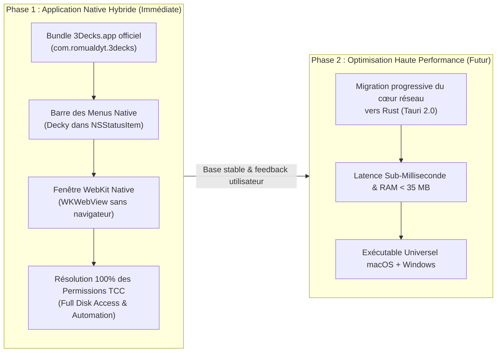

# 01 — Stratégie Recommandée & Feuille de Route

Ce document décrit la stratégie d'évolution en deux étapes pour doter 3Decks de la meilleure expérience native possible sans perturber le développement actif ni risquer de régression.

---

## 🎯 Objectif Stratégique

Offrir immédiatement aux utilisateurs Mac une véritable application **`3Decks.app`** :
1. Installable dans `/Applications`.
2. Visible sous le nom et le logo officiel **3Decks** dans les Réglages Système macOS (*Confidentialité et sécurité*).
3. Intégrée à la barre des menus (`NSStatusItem`) avec l'avatar de Decky et l'état en direct de la 3DS.
4. Ouvrant l'éditeur dans une **fenêtre macOS dédiée** (WebKit `WKWebView`) plutôt que dans un onglet du navigateur.
5. Préparant le terrain pour un cœur d'exécution ultra-performant à terme.

---

## 📅 Les Deux Phases d'Exécution

---

## Phase 1 : L'Application Native Hybride macOS (Immédiate)

### 1. Structure du Bundle `3Decks.app`
- Identifiant unique : `com.romualdyt.3decks`.
- Icône Retina compilée : `3Decks.icns` avec les formats 16x16 à 1024x1024.
- `Info.plist` déclarant `LSUIElement = true` (l'application réside dans la barre des menus et n'encombre pas le Dock en permanence).
- `Entitlements.plist` configuré pour les accès disque et Apple Events nécessaires.

### 2. Composant Barre des Menus (`Tray`)
- L'icône de Decky dans la barre des menus reflète l'état réel de la console :
  - **Gris** : En attente de connexion de la 3DS.
  - **Vert** : 3DS connectée et synchronisée (affiche le nom de la console au survol).
  - **Orange / Pause** : Communication temporairement suspendue.
- Menu d'accès rapide :
  - *Ouvrir le configurateur* (affiche la fenêtre dédiée).
  - *Console connectée* (informations IP et statut).
  - *Suspendre / Reprendre*.
  - *Réglages système rapides* (raccourci vers les autorisations macOS).
  - *Quitter*.

### 3. Fenêtre WebKit Dédiée (`WKWebView`)
- Au lieu de lancer Safari ou Chrome avec une URL à token `http://127.0.0.1:38124/?token=...` :
  - L'application instancie une `NSWindow` personnalisée avec un `WKWebView`.
  - La fenêtre adopte le thème sombre/clair du système, avec des coins arrondis macOS et une barre d'outils unifiée.
  - La navigation reste strictement cantonnée au loopback local pour la sécurité.

---

## Phase 2 : Migration vers un Cœur Rust / Tauri 2.0 (Feuille de route long terme)

Une fois l'application Phase 1 éprouvée :
1. Remplacer le transport réseau Python (`asyncio` sockets) par un module Rust utilisant `tokio` :
   - Réduction de la mémoire à moins de 35 MB.
   - Latence réseau ultra-déterministe (< 1 ms).
2. Conserver l'intégralité du frontend React 19 et des layouts de boutons sans réécriture côté interface.
3. Permettre la génération d'un installateur Windows MSIX / NSIS et macOS DMG avec la même base de code Rust.
