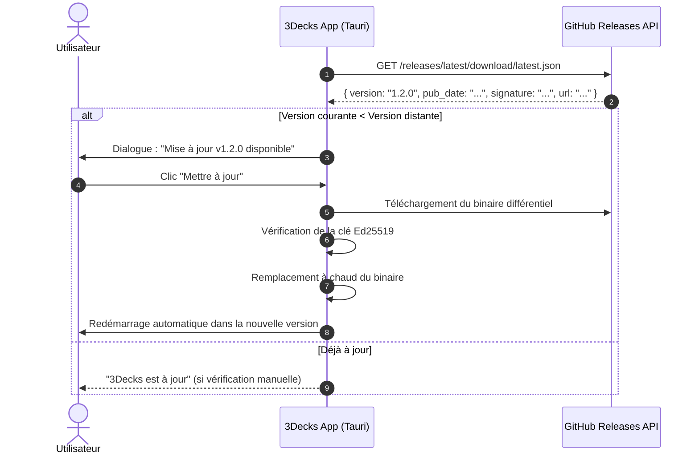

# 08 — Système de Mises à Jour Automatiques via GitHub Releases (Tauri 2.0)

Ce document spécifie l'architecture du système de mise à jour automatique (*In-App Auto-Updater*) basé sur le plugin officiel **Tauri Updater** et l'infrastructure gratuite **GitHub Releases**.

---

## 1. Pourquoi Tauri + GitHub Releases est la Solution Idéale

Avec la plupart des frameworks de bureau, mettre en place un système de mise à jour automatique nécessite un serveur dédié (ex: Hazel, serveur S3, AWS CloudFront).

Avec **Tauri 2.0** :
1. **Zéro serveur à payer ou maintenir** : GitHub Releases sert de CDN mondial ultra-rapide et gratuit.
2. **Cryptographiquement inviolable** : Chaque binaire est signé avec une clé privée asymétrique (algorithme Ed25519 / `minisign`). L'application vérifie la signature avant d'installer : impossible d'injecter un binaire corrompu ou falsifié.
3. **Expérience utilisateur 1-clic** : L'utilisateur ne retourne jamais sur le navigateur ni sur GitHub. Une notification native s'affiche :
   > *« 3Decks v1.2.0 est disponible. Télécharger et redémarrer ? »*
   Le clic télécharge la mise à jour en tâche de fond, remplace l'exécutable et redémarre instantanément.

---

## 2. Fonctionnement du Mécanisme



---

## 3. Configuration dans `tauri.conf.json`

```json
{
  "plugins": {
    "updater": {
      "active": true,
      "endpoints": [
        "https://github.com/RomualdYT/3Decks/releases/latest/download/latest.json"
      ],
      "pubkey": "dW50cnVzdGVkIGNvbW1lbnQ6IG1pbmlzaWduIHB1YmxpYyBrZXk...",
      "dialog": true
    }
  }
}
```

---

## 4. Pipeline GitHub Actions Automatisé (`release.yml`)

À chaque publication d'un tag Git (ex: `git tag v1.2.0 && git push origin v1.2.0`) :

1. Le workflow officiel `tauri-apps/tauri-action` se déclenche :
   - Compile le binaire universel macOS (`arm64` Apple Silicon + `x86_64` Intel).
   - Compile le binaire Windows (`x64`).
   - Signe automatiquement les binaires avec la clé secrète stockée dans les *GitHub Secrets* du dépôt.
   - Génère le fichier d'index `latest.json` avec les empreintes et les liens de téléchargement.
2. Le workflow publie la **Release GitHub** avec tous les fichiers attachés (`.dmg`, `.msix`, `.exe`, `latest.json`).
3. En moins de 5 minutes, tous les utilisateurs de 3Decks à travers le monde reçoivent la proposition de mise à jour au lancement de leur application !

---

## 5. Déclencheurs de Mise à Jour dans l'Application

1. **Vérification silencieuse au démarrage** : Une fois par jour ou à l'ouverture de l'application (paramétrable dans les réglages).
2. **Vérification manuelle depuis la barre des menus** :
   - Un clic sur l'icône de Decky dans la barre des menus / zone de notification -> **« Rechercher les mises à jour… »**.
